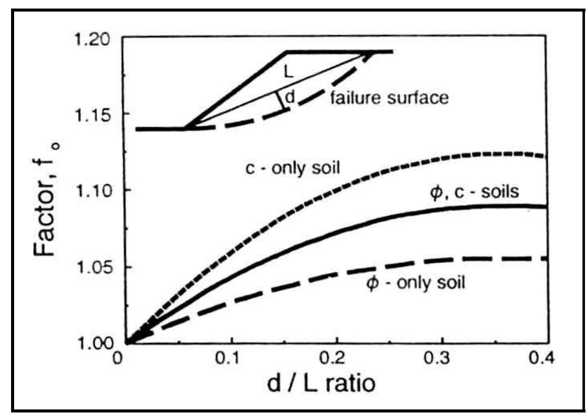

#Janbu Method

Janbu's Simplified Method is one of the earliest and most commonly used slope stability analysis techniques based on limit equilibrium principles. It provides an approximate factor of safety (FS) for a mass of soil sliding along a specified failure surface by assuming force equilibrium in the horizontal direction only. The method was developed by Norwegian engineer **Nils Janbu** in the 1950s to simplify slope stability analysis for circular and non-circular failure surfaces. It builds on the idea of dividing the soil mass into vertical slices and analyzing each slice individually while applying force balance in the horizontal direction. This method is especially favored for hand calculations and preliminary screening due to its simplicity. However, it is also inherently conservative because it does not enforce moment equilibrium or consider interslice side forces directly.

The factor of safety computed by Janbu’s simplified method typically **underestimates** the true FS and is therefore considered conservative. A correction factor was later introduced to compensate for the oversimplifications inherent in the method.

Key Assumptions:

- **Force equilibrium only**: Satisfies equilibrium in the **horizontal direction**; vertical and moment equilibrium are not enforced.
- **No side forces**: Interslice normal and shear forces are **ignored** (assumed to cancel out overall).
- **Base forces only**: Slice weight, pore pressure, cohesion, and base friction are considered.
- **Correction factor**: An empirical correction factor \( f_o \) is applied to account for the neglected side forces and moment imbalance.

##  Equations

The force equilibrium is applied in the horizontal direction for the entire sliding mass:

>>$\sum S_i = \sum T_i$

Where:

>>$S_i$ = Shear resistance at base of slice $i$ 
>>$T_i$ = Driving force from weight of slice $i$

The resisting force for each slice is:

>>$S_i = c_i \ell_i + \dfrac{(N_i - u_i \ell_i) \tan\phi_i}{F}$

And:

>>$N_i = W_i \cos\alpha_i$ 
>>$T_i = W_i \sin\alpha_i$

The factor of safety $F$ is solved iteratively from:

>>$F = \dfrac{\sum \left[ c_i \ell_i + (N_i - u_i \ell_i) \tan\phi_i / F \right]}{\sum W_i \sin\alpha_i}$

This is solved using successive substitution where the prior factor of safety is used to calculate the new factor of safety. The process is repeated until the change in factor of safety is negligible.

## Correction Factor $f_o$

To account for the neglect of interslice forces and moment equilibrium, Janbu proposed a correction factor:

The correction factor $f_o$ is based on the following relationship:

>>{ width=50% }

The d/L ratio is the ratio of the distance from the center of the failure surface to the point of interest (d) and the length of the failure surface (L). The correction factor is used to account for the fact that the Janbu method does not satisfy moment equilibrium. The correction factor is a function of the d/L ratio and is calculated using the following equation:

>>$f_o = 1 + b_1  * \left[\dfrac{d}{L} - 1.4 * \left(\dfrac{d}{L}\right)^2\right]$

The $b_1$ value is a function of the soils in the slope and is found as follows:

| Soil Type                           | $b_1$ |
|-------------------------------------|-------|
| c-only soil (undrained, $\phi$ = 0) | 0.67  |
| c-$\phi$ soil                       | 0.5   |
| $\phi$-only soil (no cohesion)      | 0.31  |

This correction attempts to mimic the effects of moment balance and interslice forces without modeling them directly.

---

## Summary

Advantages:

- Fast and easy to compute
- Conservative (safe) results
- Effective for preliminary design and parametric studies
- Can be applied to circular and non-circular failure surfaces

Limitations:

- May significantly underestimate FS for complex geometries
- Not suitable for highly irregular slopes or layered soils with complex interactions
- Not a complete equilibrium method (no moment or interslice force balance)

