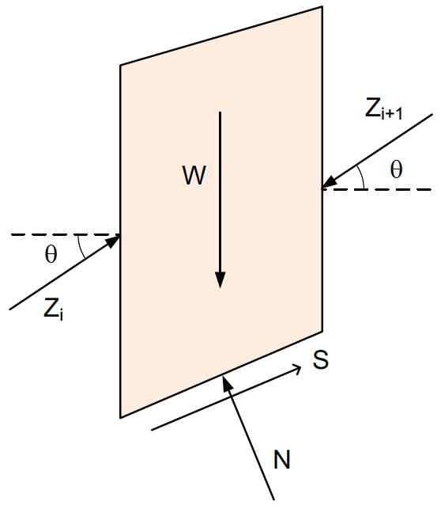
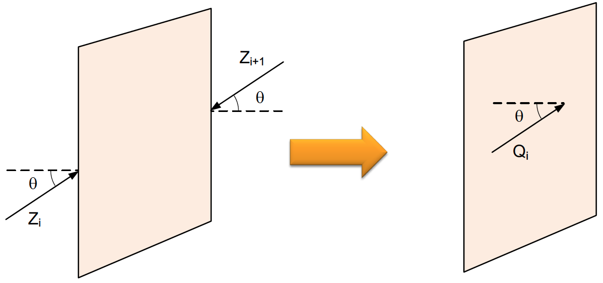
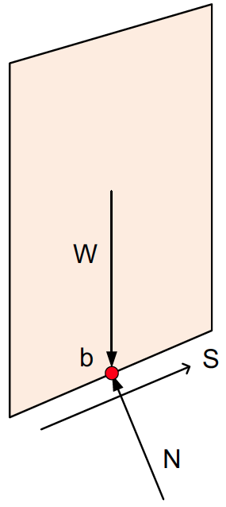
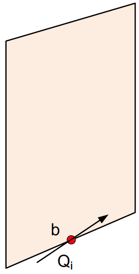
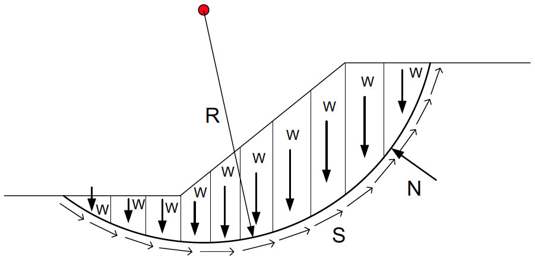
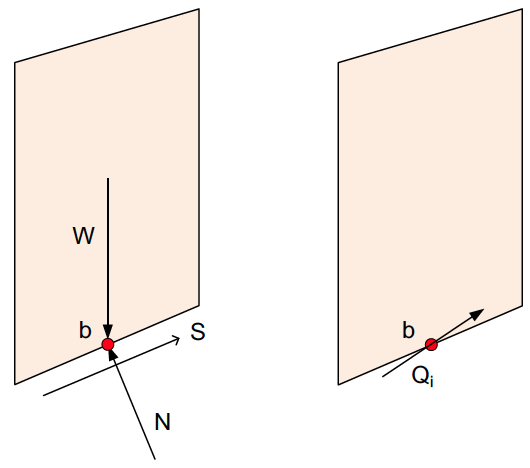
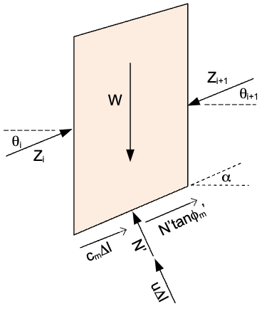
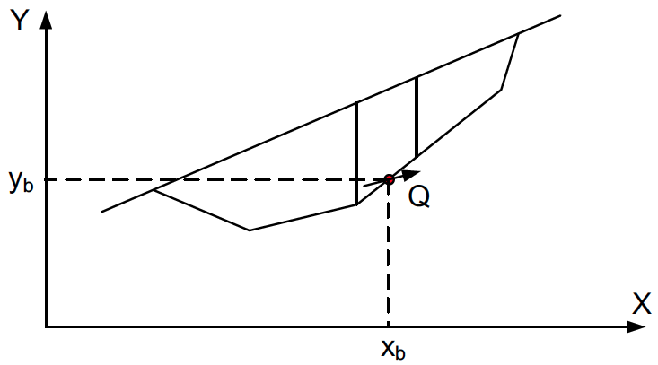

# Spencer's Method

Spencer's Method is a complete equilibrium slope stability method that satisfies both force and moment equilibrium 
and can be used on circular and non-circular slip surfaces. The primary assumption for Spencer's method is that all 
side forces are parallel, i.e., the interslice forces have a constant inclination angle $\theta$.

The following forces are considered on each slice:

>{width=400px}

**Unknowns:**

- 1 factor of safety $F$
- $n$ normal forces $N$
- $n - 1$ side forces $Z$
- 1 inclination angle $\theta$
- $n - 1$ locations for $Z$

Total unknowns = $3n$

**Equilibrium equations:**

- $n$ moment equilibrium equations
- $n$ force equilibrium equations in the horizontal direction
- $n$ force equilibrium equations in the vertical direction

Total equations = $3n$

The basic idea of Spencer's methods is that the two interslice forces $Z_i$ and $Z_{i+1}$ are combined into a single **resultant force** $Q_i$ acting at an angle $\theta$.

>{width=700px}

Since the assumption is that all interslice forces are parallel, $Q_i$ captures the net effect of $Z_i$ and $Z_{i+1}$. More specifically:

>$Q_i$ = $Z_{i+1}$ - $Z_i$

We also assume that W, S, and N act through the center of the base of each slice. This is a reasonable assumption for most practical applications.

>{width=200px}

Therefore, Qi must also act through the same point b in order to maintain moment equilibrium:

>{width=200px}

## Moment Equilibrium

For overall moment equilibrium, we can sum the moments about the circle center for all slices:

>{width=700px}

and we get:

>$\sum M = \sum (W R \sin \alpha) - \sum (S R) = 0$

Where:

>$\alpha$ = base inclination of slice 
$R$ = moment arm to center

Since Q acts through point b, Q must be equal to the sum of W, S, and N. Therefore, we can work in terms of Q.

>{width=400px}

There are two components of Q:

>$Q_\perp = Q \sin(\alpha - \theta)$  (perpendicular to base)

>$Q_\parallel = Q \cos(\alpha - \theta)$  (parallel to base)

Now if we sum moments in terms of Q, we get:

>$\sum M = \sum (R Q_i \cos(\alpha - \theta)) = 0$

## Force Equilibrium

For overall force equilibrium, we can sum the forces in the vertical and horizontal directions for all slices:

>$\sum F_v = \sum Q \sin \theta = 0$

>$\sum F_H = \sum Q \cos \theta = 0$

Since $theta$ = constant, both simplify to:

>$\sum Q = 0$

## Deriving an Expression for $Q$

In order to solve the equilbrium equations, we need to derive an expression for $Q_i$. We start with the following 
detailed diagram of a slice:

>

where: 

>$W$ = weight of the slice (vertical) 
$N$ = normal force on base = $N'$ + $u \Delta \ell$ 
$N'$ = effective normal force on base  
$S$ = shear force on base = $c_m \Delta \ell + N' \tan \phi_m'$ 
$c_m$ = mobilized cohesion = $\dfrac{c}{F}$ 
$tan \phi_m'$ = mobilized friction  = $\dfrac{tan\phi'}{F}$ 
$Z_i$ = side force on interslice boundary 
$theta$ = interslice force inclination 
$\alpha$ = base inclination 
$\Delta x$ = horizontal width of slice 
$\Delta \ell$ = length along base of slice 
$u$ = pore pressure

**Step 1** - Resolve Equilibrium Perpendicular to the Base

>$Q \sin(\alpha - \theta) + N = W \cos \alpha  \qquad (1)$

**Step 2** - Resolve Equilibrium Parallel to the Base

>$Q \cos(\alpha - \theta) + S = W \sin \alpha   \qquad (2)$

**Step 3** - Shear Strength (Mohr–Coulomb Criterion)

>$S = \dfrac{1}{F} \left( c \Delta \ell + \sigma' \tan \phi' \right)$

Where:

>>$\Delta \ell = \Delta x \sec \alpha$ 
> $\sigma' = \dfrac{N}{\Delta \ell} - u$

Substitute in:

>$S = \dfrac{1}{F} \left[ c' \Delta x \sec \alpha + (N - u \Delta x \sec \alpha) \tan \phi' \right]  \qquad (3)$

**Step 4** = Eliminate $N$ 

From (1):

>$N = W \cos \alpha - Q \sin(\alpha - \theta)$

Substitute into (3):

>$S = \dfrac{1}{F} \left[ c' \Delta x \sec \alpha + (W \cos \alpha - Q \sin(\alpha - \theta) - u \Delta x \sec \alpha)
> \tan \phi' \right]  \qquad (4)$

**Step 5** = Substitute $S$ into (2)

>$Q \cos(\alpha - \theta) + S = W \sin \alpha$

Substitute (4):

>$Q \cos(\alpha - \theta) + \dfrac{1}{F} \left[ c' \Delta x \sec \alpha + (W \cos \alpha - Q \sin(\alpha - \theta) - 
> u \Delta x \sec \alpha) \tan \phi' \right] = W \sin \alpha$

**Step 6** = Solve for $Q$

Group terms:

>$Q \left[ \cos(\alpha - \theta) - \dfrac{1}{F} \sin(\alpha - \theta) \tan \phi' \right] =
W \sin \alpha - \dfrac{1}{F} \left[ c' \Delta x \sec \alpha + (W \cos \alpha - u \Delta x \sec \alpha) \tan \phi' 
> \right]$

Final form:

>$Q = \dfrac{
W \sin \alpha - \dfrac{c'}{F} \Delta x \sec \alpha - \dfrac{(W \cos \alpha - u \Delta x \sec \alpha) \tan \phi'}{F}
}{
\cos(\alpha - \theta) \left( 1 + \dfrac{\tan(\alpha - \theta) \tan \phi'}{F} \right)
}$

Writing in terms of $\Delta \ell$:

>$Q = \dfrac{
W \sin \alpha - \dfrac{c'}{F} \Delta \ell - \dfrac{(W \cos \alpha - u \Delta \ell) \tan \phi'}{F}
}{
\cos(\alpha - \theta) \left( 1 + \dfrac{\tan(\alpha - \theta) \tan \phi'}{F} \right)
}$

## Solving the System of Equations

We now have **two equations**:

- $\sum Q \cos(\alpha - \theta) = 0$ (moment equilibrium)
- $\sum Q = 0$ (force equilibrium)

and **two unknowns**:

- Factor of safety $FS$
- Interslice force inclination $\theta$

For non-circular surfaces, we can use coordinates of base center $(x_b, y_b)$ to write the moment equation:

>{width=600px}

>$\sum M = \sum \left[ x_b (-Q \sin \theta) + y_b (Q \cos \theta) \right] = 0$

Again, solved simultaneously with:

>$\sum Q = 0$

In both cases, we need to solve for $FS$ and $\theta$ **iteratively**. 

To do this, we assume a value for $theta$ and then find the factor of safety that satisfies the moment equilibrium equation $FS_{mom}$ and the factor of safety that satisfies the force equilibrium equation, $FS_{force}$. If the two are different, we pick a new value of $theta$ and iterate until they converge, i.e., $FS_{mom}$ = $FS_{force}$.

## Solving for the Normal Force

It is useful to solve for the effective normal force at the same time that the factor of safety is calculated. These 
can be plotted (as stresses) along with the line of thrust. Negative values are another indicator of tension in the 
slice. We can do this as follows:

>>$\sum F_y = 0 \Rightarrow \left[c_m \Delta \ell + N' tan(\phi_m)\right] sin(\alpha) + (N' + u \Delta \ell) cos(\alpha) -  W + X_{i} - X_{i+1} = 0$

>>$c_m \Delta \ell  sin(\alpha) + N' tan(\phi_m) sin(\alpha) + N' cos(\alpha) + u \Delta \ell cos(\alpha) - W + X_{i} - X_{i+1} = 0$

>>$c_m \Delta \ell  sin(\alpha) + N' \left[tan(\phi_m) sin(\alpha) +  cos(\alpha)\right] + u \Delta \ell cos(\alpha) - W + X_{i} - X_{i+1} = 0$

Solving for $N'$ gives:

>>$N' = \dfrac{- c_m \Delta \ell  sin(\alpha) - u\Delta \ell cos(\alpha) + W - X_{i} + X_{i+1}}{tan(\phi_m) sin(\alpha) + cos(\alpha)}$

## Summary

- Assumes constant side force inclination $\theta$
- Works for circular and non-circular surfaces
- Satisfies both force and moment equilibrium
- Must be solved iteratively
- $Q$ represents the net interslice force and is central to the formulation
